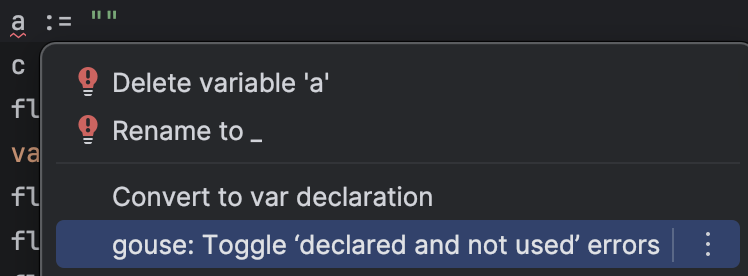
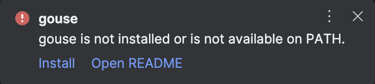
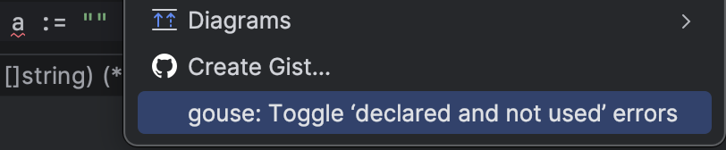
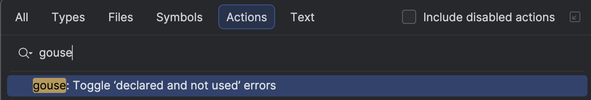

# gouse-idea

Toggle ‘declared and not used’ errors in Go by using idiomatic `_ = notUsedVar`
and leaving a TODO comment.


### Quick Action



### One-Click Install



### Context Menu



### Find Action



## Dependencies

[`gouse`](https://github.com/looshch/gouse) is required.

```bash
go install github.com/looshch/gouse/v2@latest
```

## Usage

`gouse: Toggle ‘declared and not used’ errors` toggles the errors in a file.

The plugin also adds a light-bulb quick action that runs `gouse` for the
current file.

You can run the same action from the editor right-click context menu or from
Find Action.

If `gouse` is missing, the plugin can offer a one-click install. That still
requires the Go toolchain to be available on your `PATH`.

If `gouse` is installed somewhere non-standard, set the executable path in
`Settings | Tools | gouse`.

By default, if `gouse.path` is empty and `gouse` is already installed, the
plugin tries to update `gouse` to the latest version in the background on
startup. You can disable this with the startup auto-update checkbox in settings.
